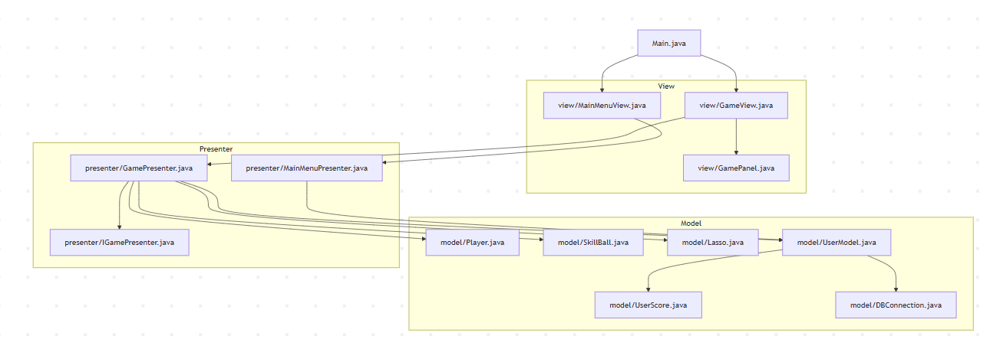

notes: (tobe deleted)
- model, isinya logika untuk berkomunikasi dengan database (dedicated untuk logika dan query untuk database)
- presenter, dianalogikan sebagai mesin yang mengolah inputan dengan data yang diambil dari model. isinya fungsi untuk mengolah input dan data dari database.
- view, untuk tampilan dan logika tampilan


# 16-Bit Video Game Using JAVA and MVP Framework 
_Saya Natasha Adinda Cantika dengan NIM 2312120 mengerjakan TMD dalam mata kuliah DPBO untuk keberkahanNya maka saya tidak melakukan kecurangan seperti yang telah dispesifikasikan. Aamiin_

## Dependencies
1. Java versi 8 keatas
2. XAMPP
3. mysql-connector-j-9.3.0

## Struktur direktori
```
/TMD/
│
├── src/
│   ├── model/                 
│   │   ├── DBConnection.java           ← Menyediakan koneksi ke database dan membuat tabel jika belum ada
│   │   ├── UserScore.java              ← Kelas data (POJO) yang merepresentasikan entitas user dan skornya
│   │   ├── UserModel.java              ← Akses data (DAO) untuk operasi CRUD terhadap tabel user; berinteraksi dengan database
│   │   ├── Player.java                 ← Representasi objek pemain dalam game (posisi, gambar, dll)
│   │   ├── SkillBall.java              ← Representasi objek bola skill; tidak disimpan di database
│   │   └── Lasso.java                  ← Representasi tali lasso
│   │
│   ├── view/
│   │   ├── MainMenuView.java           ← Menampilkan tampilan awal game (menu, input nama, tabel skor)
│   │   ├── GameView.java               ← Jendela utama (JFrame) yang menampung GamePanel dan mengatur layout
│   │   ├── HUDPanel.java               ← Jpanel tempat skor, count, dan time remaining dibuat
│   │   └── GamePanel.java              ← Komponen utama untuk merender game, menerima input keyboard, dan menangani animasi
│   │
│   ├── presenter/
│   │   ├── KontrakGamePresenter.java 
│   │   ├── MainMenuPresenter.java      ← Menangani logika input di menu awal dan interaksi dengan UserModel
│   │   └── GamePresenter.java          ← Menangani logika gameplay (pergerakan, skor, interaksi dengan objek game)
│   │
│   └── Main.java                       ← Entry point program, menginisialisasi dan menjalankan tampilan utama
│
├── lib/                                ← Folder untuk menyimpan MySQL JDBC Driver (e.g., mysql-connector.jar)
│
├── assets/                             ← Berisi gambar karakter, bola, background, dll
│
└── README.md
```
Jika divisualisasikan akan terlihat sebagai berikut:


## Cara Kerja Program
terdapat beberapa jenis bola kekuatan yang bisa diambil
1. bola baik
bola baik akan memberikan efek +poin apabila berhasil ditangkap. Terdapat 3 bola baik yaitu: 
    - ikut kelas (+10 poin) 
    - latihan (+15 poin)
    - makan (+5 poin)
2. bola powerups
bola powerups akan memberikan beberapa efek seperti berikut: 
    - ikut bootcamp (poin x2 selama 20 detik kedepan)
    - istirahat (waktu +10 detik)
3. bola buruk
bola buruk disisi lain, akan memberikan efek sebagai berikut:
    - doom scrolling (-30 detik)
    - vibe coding (-20 poin)

## Cara penggunaan
1. eksekusi program dengan menjalankan command "".
2. Input nama pemain, atau pilih nama pemain yang sudah ada.
3. Tekan "START".
4. Tekan "up-down-right-left" untuk menggerakan karakter.
5. Click mouse untuk mengeluarkan sinar (lasso) untuk mengambil bola.
6. "Spasi" untuk menghentikan game sementara.
7. 